# NaverAdAutoBiddingApp
Node.js로 만들어진 네이버 검색 키워드 자동 경매 어플리케이션입니다.

```mermaid
sequenceDiagram
	participant app
	participant naver_api
	participant web
	
	autonumber
	app->>+naver_api: getKeywords()
	naver_api-->>-app: keywords

	rect rgb(10, 50, 10)
	loop per keywords
	app->>+naver_api: getBid()
	naver_api-->>-app: bid
	app->>+web: getRank()
	web-->>-app: rank
	app->>app: evaluateBid()
	app->>naver_api: putBid()
	end
	end
```

 
 

# 기능
다음을 지원합니다.
- 특정 검색어 순위 유지 기능 (web scrapping via different ways)
- 금액에 따른 탄력적 조정 기능 (hard-coded)
- 시간에 따른 탄력적 조정 기능 (cron invoke)
 
 

# CI/CD
도커 이미지 기반으로 Fargate에 배포, 운영됩니다.

   
  <i>https://devbksheen.tistory.com/entry/GitHub-Actions%EC%9C%BC%EB%A1%9C-Amazon-ECS-Fargate-%EB%B0%B0%ED%8F%AC%ED%95%98%EA%B8%B0</i>

